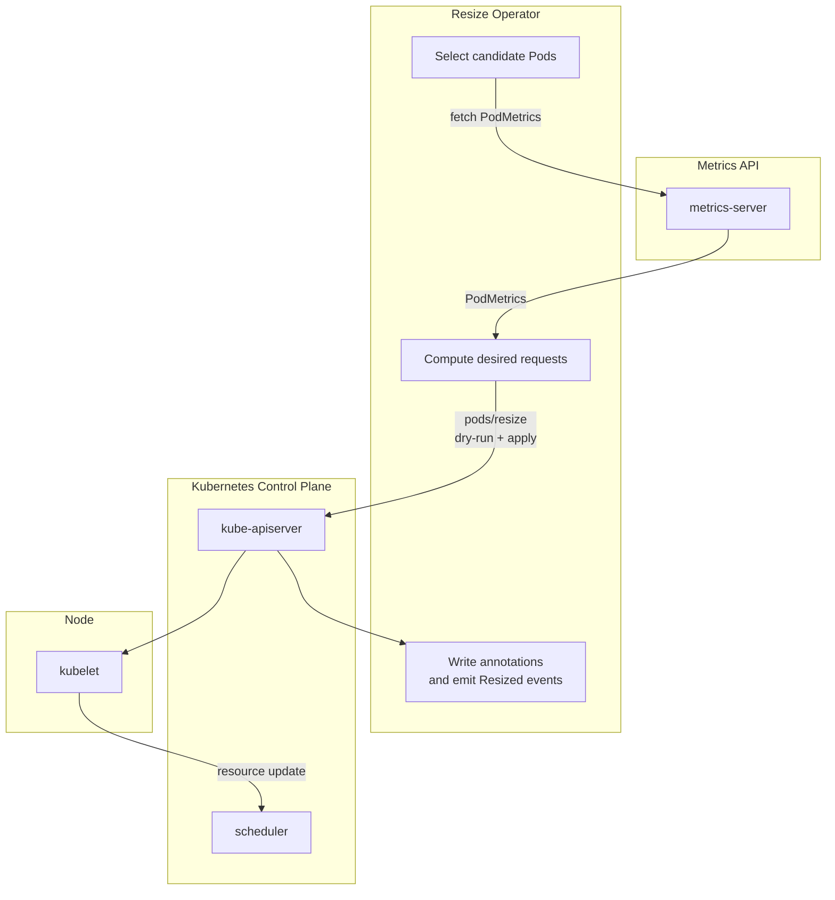

# resize-operator (alpha)

## Requirements

- **metrics-server** (pod usage via `metrics.k8s.io`)
- Kubernetes cluster with **in-place Pod resize support** (`pods/resize` subresource). The operator checks capability and degrades gracefully if unsupported.

## Fast install

```bash
kubectl create namespace resize-operator-system
helm install resize-operator oci://ghcr.io/iamhalje/charts/resize-operator
```

## How it works

On each reconcile loop the operator:

- selects candidate Pods (namespace selector + pod label selector)
- fetches `PodMetrics` from `metrics.k8s.io`
- computes desired requests based on the policy
- executes `pods/resize` (dry-run + apply)
- writes annotations and emits `Resized` events



## Resize logic

The operator computes new `requests` based on the current resource usage from `metrics.k8s.io`, using `headroomPercent`.

- **Target**: `target = usage * (1 + headroomPercent/100)`
- **Rounding**: CPU is rounded to `50m` steps, memory to `64Mi` steps
- **Small changes are skipped** based on:
  - relative thresholds `upPercent` / `downPercent`
  - absolute minimum change `minChangeCPU` / `minChangeMemory`
- **Bounds**: computed `requests` are clamped to configured min/max
- **Limits** behavior is controlled by `limitsMode`:
  - `Unchanged`: keep limits as-is
  - `EqualRequests`: set limits equal to requests
- **Anti-thrash**:
  - `stabilizationWindow`: the desired target must stay stable before apply
  - `cooldown`: skip pods shortly after a resize

## Observability

- Grafana dashboard: [docs/grafana/resize-operator-dashboard.json](docs/grafana/resize-operator-dashboard.json)

## More docs

- CRD reference: [docs/crd.md](docs/crd.md)
